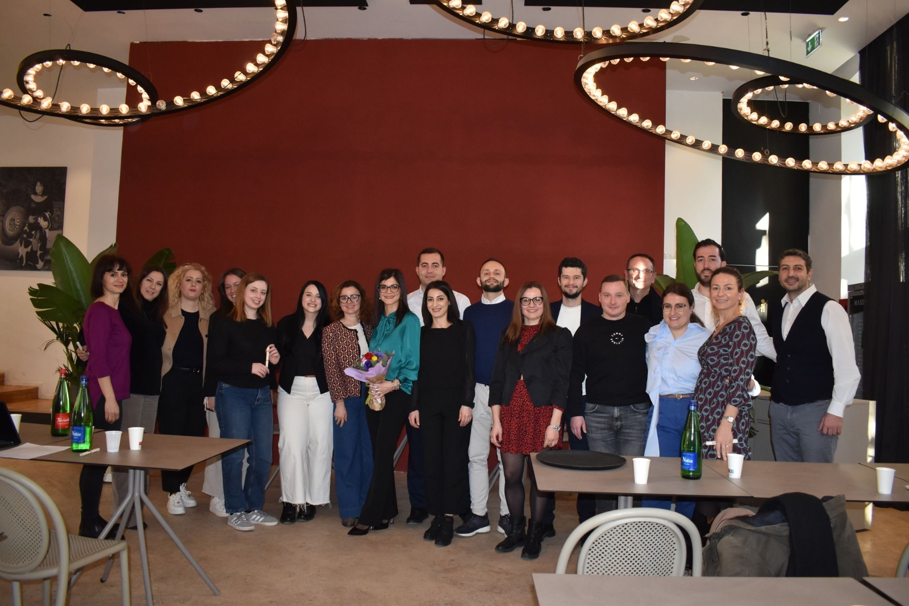
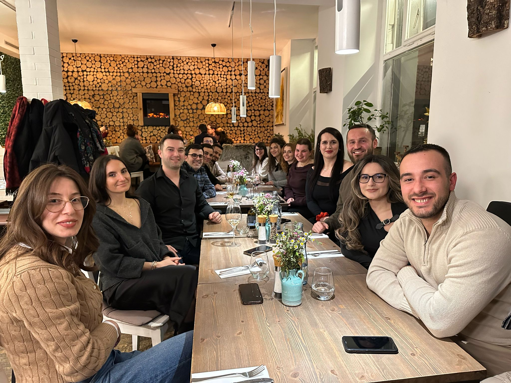
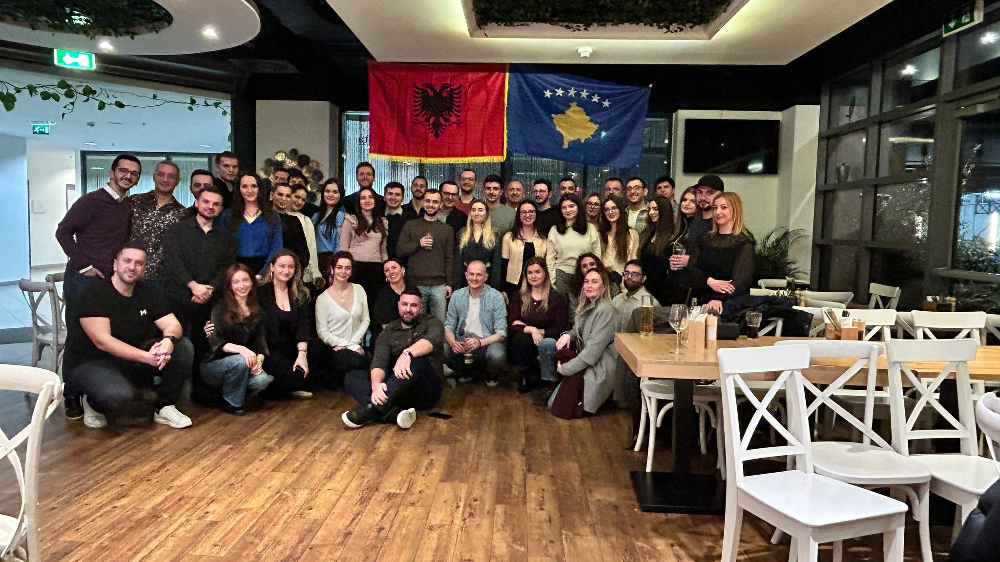
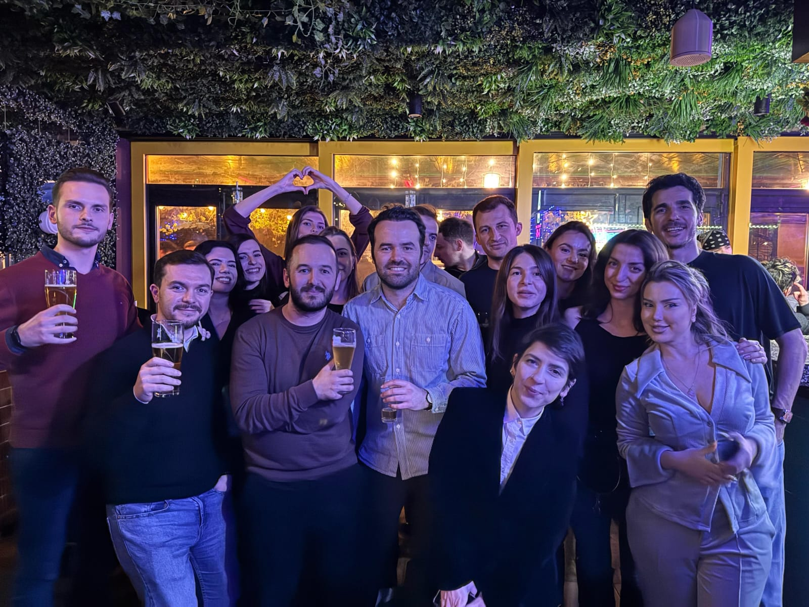
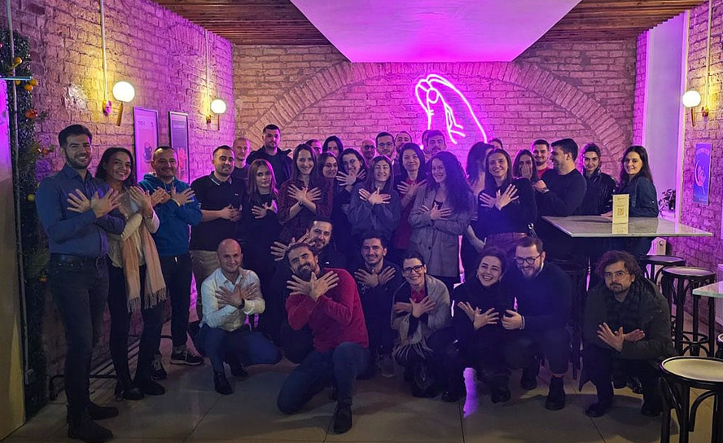
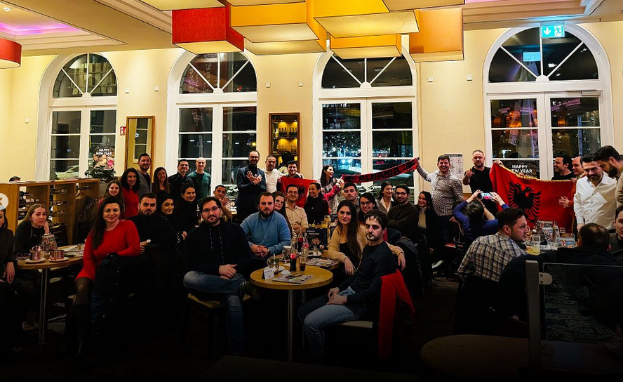
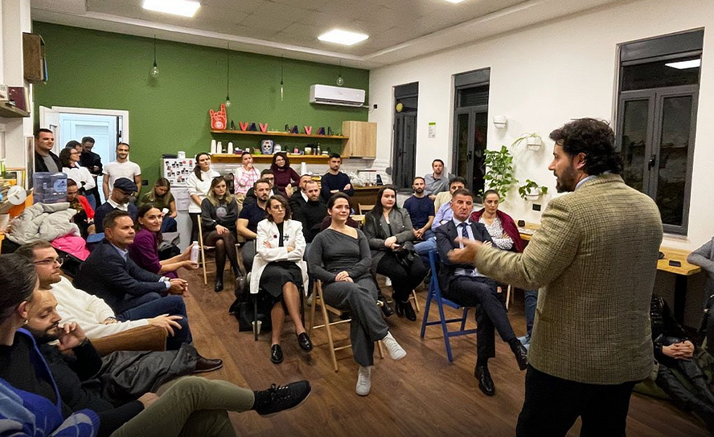
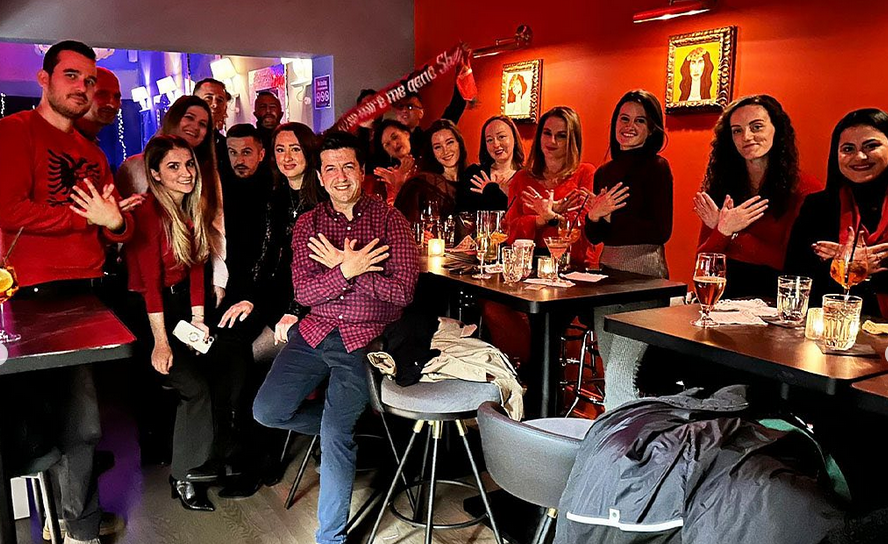

## 🌍 Happy Hours 
--------

  

    
  

  

    
  

  

    
  

  

    
  

  

    
  

  

    
  

  

    
  

  

    
  

  

## 🌍 Mundësi Bashkëpunimi
------

- 🏆 **Rrjet Global Profesionistësh**  
  Lidhu me profesionistë nga e gjithë bota dhe zgjero horizontin tënd.

- 🎓 **Mentorim & Këshilla Profesionale**  
  Mëso nga ata që kanë kaluar sfida të ngjashme dhe kanë arritur sukses.

- 🎤 **Evente & Konferenca**  
  Merr pjesë në evente ekskluzive dhe ndërto lidhje të forta profesionale.

- 🌎 **Bashkëpunime Ndërkombëtare**  
  Bashkëpuno me kompani dhe organizata me ndikim global.

  

## 🌍 Ndër diskutimet e fundit!

### [IB-Tech Anniversary Celebration](https://forum.illyrianbrains.dev/t/367)
**👤 Author:** adriankodja  
**👀 Views:** 41  ❤️ Likes: 1   💬 Replies: 1

### [Berlin meetup - Meso Gjermanisht](https://forum.illyrianbrains.dev/t/378)
**👤 Author:** pomodoren  
**👀 Views:** 21  ❤️ Likes: 0   💬 Replies: 1

  
